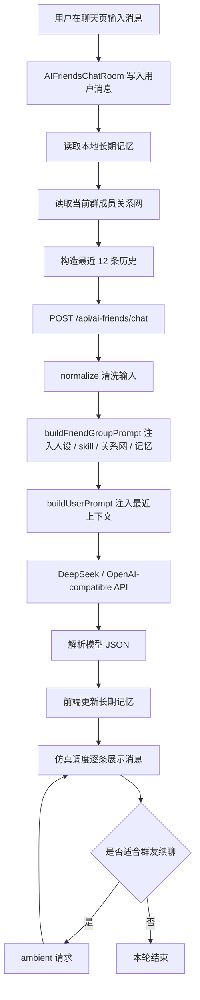

# AI 朋友群聊项目拆解文档

本文档用于完整说明当前项目的产品定位、技术架构、页面结构、AI 朋友系统、长期记忆、人物关系网、数据存储和后续迭代方向。

项目路径：

```text
C:\Users\23255\Documents\ziki的朋友庄园
```

本地访问入口：

```text
http://localhost:3000/ai-friends
```

## 1. 项目定位

这是一个网站版 AI 朋友群聊 Demo。它的目标不是做普通 AI 助手，而是模拟一个“真实社交软件里的 AI 朋友群”。

用户进入后，第一屏是类似微信/QQ/WhatsApp 的消息列表，可以进入不同群聊、私聊 AI 朋友、创建或删除群聊、创建或删除 AI 朋友，并编辑 AI 朋友的人设、头像、群成员和人物关系。

项目目前重点已经从“朋友庄园”转向“AI 朋友群聊体验”。朋友庄园相关页面仍在项目中，但当前主线功能是 `/ai-friends` 下的社交聊天 Demo。

## 2. 技术栈

项目基于 Next.js App Router 构建。

主要技术：

- Next.js 15 App Router
- React 19
- TypeScript
- Tailwind CSS
- lucide-react 图标
- OpenAI-compatible API 适配层
- DeepSeek API 接入
- localStorage 本地状态持久化
- Supabase 相关代码保留，但 AI 朋友群聊当前主要依赖本地存储

主要脚本：

```bash
npm run dev
npm run build
npm run lint
npm run typecheck
```

## 3. 顶层目录结构

```text
app/
  ai-friends/
  api/
  auth/
  avatar/
  chat/
  garden/
  message-wall/
  room/

components/
  ai-friends/
  auth/
  avatar/
  chat/
  garden/
  messages/
  room/

lib/
  ai/
  db/
  supabase/
```

当前最重要的代码集中在：

```text
app/ai-friends
app/api/ai-friends
components/ai-friends
lib/ai
```

## 4. 主要页面

### 4.1 消息首页

路径：

```text
/ai-friends
```

文件：

```text
app/ai-friends/page.tsx
components/ai-friends/AIFriendsInbox.tsx
```

功能：

- 展示群聊列表
- 展示 AI 朋友通讯录
- 搜索群聊和 AI 朋友
- 新建群聊
- 删除群聊
- 新建 AI 朋友
- 删除 AI 朋友
- 进入群聊
- 进入 AI 朋友私聊
- 进入人物关系网
- 进入群聊设置

这个页面是整个 AI 朋友系统的主入口。

### 4.2 群聊页

路径：

```text
/ai-friends/[groupId]
```

文件：

```text
app/ai-friends/[groupId]/page.tsx
components/ai-friends/AIFriendsChatRoute.tsx
components/ai-friends/AIFriendsChatRoom.tsx
```

功能：

- 展示社交软件式聊天界面
- 支持用户发送消息
- 支持 AI 朋友逐条、延迟、仿真式回复
- 支持右键 @ 或引用消息
- 支持聊天记录本地保存
- 支持长期记忆上下文
- 支持关系网注入 prompt
- 支持群友自动续聊

目前聊天页是项目最核心的体验模块。

### 4.3 AI 朋友私聊页

路径：

```text
/ai-friends/dm/[friendId]
```

文件：

```text
app/ai-friends/dm/[friendId]/page.tsx
components/ai-friends/AIFriendDirectRoute.tsx
```

功能：

- 与单个 AI 朋友私聊
- 复用群聊组件 `AIFriendsChatRoom`
- 私聊时后端会限制只允许这一个朋友发言
- 回复数量会比群聊更少，更像真实私聊

### 4.4 群聊设置页

路径：

```text
/ai-friends/settings/[groupId]
```

文件：

```text
app/ai-friends/settings/[groupId]/page.tsx
components/ai-friends/AIFriendSettingsRoute.tsx
components/ai-friends/AIFriendSettingsPage.tsx
```

功能：

- 编辑自己的资料
- 更换自己的头像
- 编辑自己的状态和偏好的聊天方式
- 管理某个群聊里的 AI 朋友成员
- 编辑 AI 朋友的：
  - 名字
  - 标题
  - 头像
  - 颜色
  - 关系定位
  - 性格底色
  - 说话风格
  - 群内分工
  - 关心重点
  - 小习惯
  - 边界感

这里编辑的是“某个群聊里的朋友设定”，会影响该群聊的 prompt。

### 4.5 人物关系网页

路径：

```text
/ai-friends/relations
```

文件：

```text
app/ai-friends/relations/page.tsx
components/ai-friends/AIFriendRelationsPage.tsx
```

功能：

- 以有向图形式展示 AI 朋友之间的设定关系
- 每条边表示 “A 眼中的 B”
- 支持新增关系边
- 支持删除关系边
- 支持编辑关系文本设定
- 支持编辑量化指标
- 支持恢复默认关系网
- 保存到 localStorage

注意：这里的关系网不是接话规则，而是人物设定。它影响的是熟悉感、称呼、调侃尺度、主观看法和共同经历。

## 5. API 路由

### 5.1 聊天接口

路径：

```text
POST /api/ai-friends/chat
```

文件：

```text
app/api/ai-friends/chat/route.ts
```

请求中会包含：

- 用户消息
- 最近聊天历史
- 当前群成员
- 群聊模式
- 群聊风格
- 用户状态
- 长期记忆
- 人物关系网
- 交互类型

交互类型包括：

```ts
"user" | "ambient"
```

`user` 表示用户主动发消息。

`ambient` 表示用户没有发新消息，而是群友基于最近群聊内容自己自然接着聊。

### 5.2 主动消息接口

路径：

```text
POST /api/ai-friends/proactive
```

文件：

```text
app/api/ai-friends/proactive/route.ts
```

用于模拟系统触发的主动消息，例如天气提醒、目标提醒。当前不是主线体验，但保留了接口能力。

## 6. AI 调用适配层

文件：

```text
lib/ai/openAICompatible.ts
```

作用：

- 读取环境变量
- 兼容 DeepSeek / OpenAI-compatible API
- 发送 chat completions 请求
- 处理返回结果
- 未配置 API key 时返回 mock 错误，让上层使用本地兜底回复

支持的环境变量：

```env
DEEPSEEK_API_KEY=
AI_FRIENDS_API_KEY=
AI_FRIENDS_BASE_URL=https://api.deepseek.com
AI_FRIENDS_MODEL=deepseek-v4-flash
AI_FRIENDS_PROVIDER_NAME=DeepSeek
```

优先级：

```text
AI_FRIENDS_API_KEY > DEEPSEEK_API_KEY
```

## 7. Prompt 核心模块

文件：

```text
lib/ai/friendGroup.ts
```

这是 AI 朋友群聊的核心 prompt 构建模块。

主要职责：

- 定义 AI 朋友数据结构
- 定义聊天模式
- 定义回复结构
- 定义长期记忆结构
- 清洗前端传入的数据
- 生成系统 prompt
- 生成用户 prompt
- 解析模型 JSON 输出
- 模型失败时生成本地 mock 回复

核心函数：

```ts
buildFriendGroupPrompt()
buildUserPrompt()
estimateReplyPlan()
coerceFriendGroupResponse()
parseJsonFromModel()
mockFriendGroupResponse()
normalizeFriends()
normalizeHistory()
normalizeMemoryContext()
```

### 7.1 回复格式

模型必须返回 JSON：

```json
{
  "messages": [
    {
      "friendId": "kai",
      "name": "凯凯",
      "tone": "tease",
      "content": "不是吧，你这又开始脑内连续剧了。",
      "replyTo": "娜娜"
    }
  ],
  "summary": {
    "mainPoints": [],
    "disagreement": "",
    "safestAdvice": "",
    "nextAction": "",
    "missingInfo": ""
  },
  "memoryCandidates": []
}
```

前端不会一次性展示全部消息，而是交给仿真调度器逐条展示。

## 8. 默认 AI 朋友

默认朋友定义在：

```text
lib/ai/friendGroup.ts
```

当前默认朋友：

- 娜娜：温柔但不溺爱的姐姐型朋友
- 凯凯：嘴欠但护短的损友
- 林博士：冷静拆题的研究型朋友
- 末末：靠谱行动派搭子
- 阿言：清醒现实派反对席

每个朋友包含：

- id
- name
- title
- relationship
- personality
- style
- job
- careFocus
- quirks
- boundaries
- color
- avatar

这些字段会进入 prompt，影响每个角色的发言方式。

## 9. AI 朋友 Skill 系统

文件：

```text
lib/ai/friendSkills.ts
```

Skill 系统是为了让每个朋友不只是“人设卡”，而是拥有自己的行为逻辑。

每个 skill 包含：

- attentionRadar：注意雷达
- speaksWhen：什么时候该出场
- staysQuietWhen：什么时候该沉默
- replyMoves：回应招式
- socialChemistry：和其他朋友的化学反应
- memoryFocus：记忆偏好
- antiPatterns：禁区
- sampleLines：口吻样例

例如：

- 娜娜更容易捕捉自责、委屈和情绪耗竭
- 凯凯更容易捕捉脑补、假装没事和替别人找借口
- 林博士更擅长拆事实、假设、风险和验证
- 末末负责把讨论落到低门槛行动
- 阿言负责边界、代价和不可逆风险

Skill 不直接控制 UI，而是写入 prompt，让模型在生成消息时更稳定地维持角色差异。

## 10. 人物关系网系统

文件：

```text
lib/ai/friendRelations.ts
components/ai-friends/friendRelationStorage.ts
components/ai-friends/AIFriendRelationsPage.tsx
```

人物关系网用于描述 AI 朋友之间的设定关系。

### 10.1 有向关系

每条关系是有向边：

```text
A 眼中的 B
```

这意味着：

```text
凯凯眼中的娜娜
```

和：

```text
娜娜眼中的凯凯
```

可以完全不同。

### 10.2 关系字段

每条关系包含：

- fromId：观察者
- toId：被观察者
- label：关系标签
- familiarity：熟悉度
- metrics：量化指标
- emotionalTone：情绪底色
- nickname：私人称呼
- sharedHistory：共同经历
- opinion：主观看法
- boundary：边界

### 10.3 量化指标

每条关系有 6 个 0-100 指标：

- closeness：亲近
- trust：信任
- tension：张力
- teasing：调侃
- protectiveness：保护
- influence：影响力

这些指标会进入 prompt。

含义：

- 高亲近：更像熟人，说话更不客套
- 高信任：更认可对方判断
- 高张力：更容易不服、顶嘴、有分歧
- 高调侃：更常开玩笑
- 高保护：更会维护对方
- 高影响力：更在意对方意见，容易被对方说动

注意：这些指标不是机械接话规则，而是角色关系强弱坐标。

## 11. 长期记忆与上下文压缩

文件：

```text
components/ai-friends/friendMemory.ts
lib/ai/friendGroup.ts
components/ai-friends/AIFriendsChatRoom.tsx
```

项目目前已经实现本地长期记忆。

### 11.1 记忆结构

```ts
type FriendMemoryState = {
  groupId: string;
  compactSummary: string;
  userMemory: string[];
  friendMemories: Record<string, string[]>;
  pinnedFacts: string[];
  turnCount: number;
  updatedAt: string;
};
```

### 11.2 记忆来源

模型每次回复时返回：

```ts
memoryCandidates: string[]
summary: {...}
```

前端收到后会把它写入本地记忆。

### 11.3 下一轮如何使用

用户下一次发送消息时，前端会带上：

- 最近 12 条原文历史
- 压缩摘要
- 用户长期记忆
- 朋友近期记忆
- 置顶事实

这样模型不会无限吃完整聊天记录，而是通过压缩摘要维持上下文。

### 11.4 存储 key

```text
ziki-ai-friend-memory-v1:${groupId}
```

聊天历史存储 key：

```text
ziki-ai-chat-history-v1:${groupId}
```

## 12. 群聊仿真引擎

文件：

```text
components/ai-friends/AIFriendsChatRoom.tsx
```

当前聊天体验不是“一次性显示全部 AI 回复”，而是做了仿真调度。

### 12.1 初始回复

用户发送消息后：

1. 前端把消息加入 timeline
2. 请求 `/api/ai-friends/chat`
3. 后端调用模型
4. 模型返回一组 messages
5. 前端调用 `deliverResponse`
6. 每条消息按照仿真时间逐条展示

### 12.2 速度模拟

核心函数：

```ts
buildSimulatedMessageSchedule()
```

它会考虑：

- 是否是第一条
- 是否接上一位朋友的话
- 是否同一个人连续发
- 消息长度
- 当前是不是“日常吐槽小群”
- 是否需要停顿

从而生成：

- beforeTypingMs
- typingMs
- afterSendMs

### 12.3 群友自动续聊

核心函数：

```ts
maybeRunAmbientFollowUp()
```

用户发完消息后，如果场景适合，比如日常吐槽小群，系统会等待几秒，再触发一次 `ambient` 请求。

这个请求不是用户新消息，而是：

```text
群友看到最近群聊后，自己自然接话
```

它最多生成 1-3 条，避免自动刷屏。

## 13. 本地持久化系统

当前 AI 朋友系统大量使用 localStorage。

### 13.1 群聊记录

```text
ziki-ai-chat-history-v1:${groupId}
```

### 13.2 长期记忆

```text
ziki-ai-friend-memory-v1:${groupId}
```

### 13.3 群聊成员设置

```text
ziki-ai-friend-settings-v1
```

### 13.4 用户资料

```text
ziki-ai-user-profile-v1
```

### 13.5 自定义 AI 朋友

```text
ziki-ai-custom-friends-v1
ziki-ai-hidden-friends-v1
```

### 13.6 自定义群聊

```text
ziki-ai-custom-chat-groups-v1
ziki-ai-hidden-chat-groups-v1
```

### 13.7 人物关系网

```text
ziki-ai-friend-relations-v1
```

## 14. 群聊配置系统

文件：

```text
lib/ai/friendChatGroups.ts
components/ai-friends/friendChatGroupStorage.ts
```

默认群聊包括：

- 内耗急救群
- DDL 互助小队
- 深夜情绪收容所
- 人生岔路口会议
- 日常吐槽小群

每个群聊包含：

- id
- name
- description
- lastMessage
- lastTime
- unread
- accent
- style
- mode
- userState
- friends
- initialMessages

用户可以创建自定义群聊，存在 localStorage 中。

## 15. 自定义 AI 朋友系统

文件：

```text
components/ai-friends/aiFriendRosterStorage.ts
```

功能：

- 读取可见 AI 朋友
- 创建自定义 AI 朋友
- 删除 AI 朋友
- 隐藏默认 AI 朋友
- 删除自定义朋友时同步移除群成员设置

新建朋友时会基于娜娜的默认结构生成一个初始朋友，然后替换成新名字和通用新人设定。

## 16. 核心聊天数据流



## 17. DeepSeek 接入方式

`.env.local` 中配置：

```env
DEEPSEEK_API_KEY=sk-your-key
AI_FRIENDS_BASE_URL=https://api.deepseek.com
AI_FRIENDS_MODEL=deepseek-v4-flash
AI_FRIENDS_PROVIDER_NAME=DeepSeek
```

也可以使用：

```env
AI_FRIENDS_API_KEY=sk-your-key
```

接口层会读取这些变量，并以 OpenAI-compatible 格式调用模型。

注意：不要把真实 API key 写进 README 或提交到公开仓库。

## 18. 当前已完成的重点能力

已完成：

- 社交软件式群聊入口
- 群聊页面
- 私聊入口
- 创建和删除群聊
- 创建和删除 AI 朋友
- 群成员配置
- AI 朋友人设编辑
- 用户资料编辑
- 头像上传与保存
- 聊天记录本地保存
- DeepSeek 接入
- Prompt JSON 输出约束
- 模型失败 mock 兜底
- 每个朋友的 skill 系统
- 长期记忆和上下文压缩
- 群友仿真回复速度
- 群友自动续聊
- 人物关系网
- 关系量化指标
- 关系网注入 prompt

## 19. 当前局限

目前仍有一些 Demo 阶段的限制：

- 大部分数据存在 localStorage，换浏览器或清缓存会丢失
- 没有账号体系下的云端同步
- 长期记忆不可视化管理还不完善
- 人物关系网是全局关系，不是每个群单独一套
- 自动续聊目前最多一段，不是完整多 agent 常驻系统
- AI 朋友不会真正后台在线，只是在用户打开页面时模拟
- 关系图节点位置是固定环形布局，暂时不能拖动
- 群聊通知、未读数、最后一条消息还没有完全动态化

## 20. 推荐下一步迭代

### 20.1 记忆管理页

新增一个页面查看、编辑、删除、置顶长期记忆。

可以做：

- 用户记忆
- 群聊摘要
- 每个朋友的近期记忆
- 置顶事实

### 20.2 每个群独立关系网

当前关系网是全局的。

更真实的做法是：

```text
全局关系网 + 群内局部关系修正
```

比如凯凯和娜娜全局很熟，但在某个新群里可以表现得更克制。

### 20.3 更高级的 agent 调度器

现在的调度器是：

```text
用户消息 -> 一轮模型回复 -> 可选 ambient 续聊
```

未来可以升级成：

```text
角色观察器 -> 触发判断 -> 单角色发言 -> 其他角色观察 -> 停止条件
```

也就是更像真正的多 agent 群聊系统。

### 20.4 关系图交互增强

可以加入：

- 拖动节点
- 按关系类型筛选边
- 关系强弱用线条粗细表示
- 张力高的边用虚线或红色
- 信任高的边用更深颜色
- 点击节点查看该朋友眼中的所有人

### 20.5 云端存储

如果要变成正式产品，需要把 localStorage 迁移到数据库：

- 用户资料
- AI 朋友
- 群聊
- 聊天记录
- 长期记忆
- 人物关系网

项目里已经有 Supabase 相关代码，可以作为后续迁移方向。

## 21. 关键文件索引

### 页面

```text
app/ai-friends/page.tsx
app/ai-friends/[groupId]/page.tsx
app/ai-friends/dm/[friendId]/page.tsx
app/ai-friends/settings/[groupId]/page.tsx
app/ai-friends/relations/page.tsx
```

### AI 朋友组件

```text
components/ai-friends/AIFriendsInbox.tsx
components/ai-friends/AIFriendsChatRoom.tsx
components/ai-friends/AIFriendSettingsPage.tsx
components/ai-friends/AIFriendRelationsPage.tsx
components/ai-friends/AIFriendDirectRoute.tsx
```

### 本地存储

```text
components/ai-friends/friendSettings.ts
components/ai-friends/friendMemory.ts
components/ai-friends/friendRelationStorage.ts
components/ai-friends/friendChatGroupStorage.ts
components/ai-friends/aiFriendRosterStorage.ts
```

### AI 逻辑

```text
lib/ai/friendGroup.ts
lib/ai/friendSkills.ts
lib/ai/friendRelations.ts
lib/ai/friendChatGroups.ts
lib/ai/openAICompatible.ts
```

## 22. 一句话总结

这个项目目前已经从一个简单 AI 聊天 Demo，演进成了一个带有人设、skill、长期记忆、人物关系网、量化关系指标和群聊仿真节奏的 AI 朋友群聊原型。它的核心价值不在于“回答问题”，而在于让 AI 朋友像一个真实社交小团体一样，有各自的性格、关系、记忆和聊天节奏。
